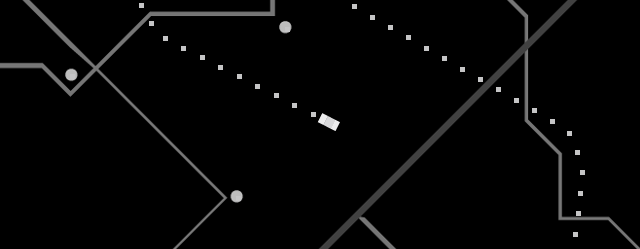

# *What We Did*

## [Play Online](https://www.pippinbarr.com/what-we-did/web/) (HTML5, not mobile-friendly)
## ~~[Download for Mac](https://github.com/pippinbarr/what-we-did/releases/tag/mac)~~
## ~~[Download for Windows](https://github.com/pippinbarr/what-we-did/releases/tag/windows)~~

## Description
*They know what we did. What do we do now?*

Originally released on 3 February 2015, *What We Did* was written in [Haxe](http://haxe.org/) using the [HaxeFlixel](http://www.haxeflixel.com/) library. It was designed and built with [Rilla Khaled](https://www.rillakhaled.com) in GameMaker over 48 hours for the 2015 Global Game Jam at the Institute of Digital Games site in Malta. The game contains various creative commons sound effects and pieces of music which are attributed in detail in its press (when I revive it).

In June of 2022 I was finally able to convince HaxeFlixel to rebuild the game as a browser-friendly HTML5 version (and Mac and Windows releases too). Nice!

## Press
*What We Did* was covered by [Kill Screen](http://killscreendaily.com/articles/what-we-did-asks-you-sympathize-criminals-plight/), [Warp Door](http://wip.warpdoor.com/2015/02/03/what-we-did-pippin-barr-rilla-khaled/), and [Rock, Paper, Shotgun](http://www.rockpapershotgun.com/tag/pippin-barr/).

## Documentation
* Check out the [code repository](https://github.com/pippinbarr/what-we-did) (includes the original HaxeFlixel project and a new one I've been using to update the exports to HTML5, Mac, and Windows)
* Read the [process documentation](../process/) to get some insight into what I was thinking about while making the game
* Download the [the original .swf file](https://github.com/pippinbarr/what-we-did/releases/tag/swf/) if you want

## License
*What We Did* is an open source game licensed under a [Creative Commons Attribution-NonCommercial 3.0 Unported License](http://creativecommons.org/licenses/by-nc/3.0/). You can obtain the source code from its [code repository](https://github.com/pippinbarr/what-we-did/) on GitHub.
