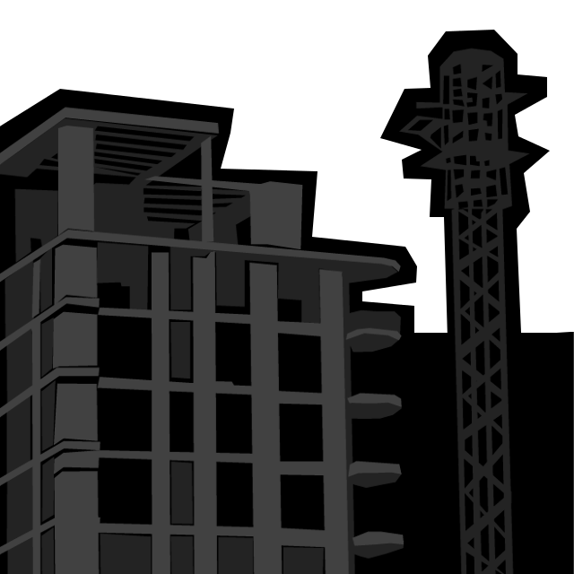

# Blog

Herein lie blog posts I wrote about the game on my public-facing blog at the time.

## What We Did: Seen (2015-01-28)

I thought I would do a quick drawing for tonight but then I realised it would be even quicker to just post one of the images I drew for Rilla&#8217;s an my game jam game, _What We Did_, instead. So that&#8217;s it, up there, right? (Note that the cut out around the top is just a transparency thing &#8211; it would normally be solid black &#8211; but it looks kind of good like this too in fact.) I encourage you _not_ to look for the game on the game jam website, as it&#8217;s a bit broken and we&#8217;re working on a port to Haxe (e.g. Flash) right now which should be done in a few days.

The style is another attempt to distance myself, or at least dabble away from, my predilection for pixel graphics. Along with _Sound System I_ (filled circles and paintings) and _Let&#8217;s Play: Let&#8217;s Play: Ancient Greek Punishment: Art Edition Edition_ (photography and webcams) it&#8217;s a step in a different direction. It&#8217;s produced by just using the polygonal lasso on top of photos and choosing four or five greys to fill with. Simple but effective.
